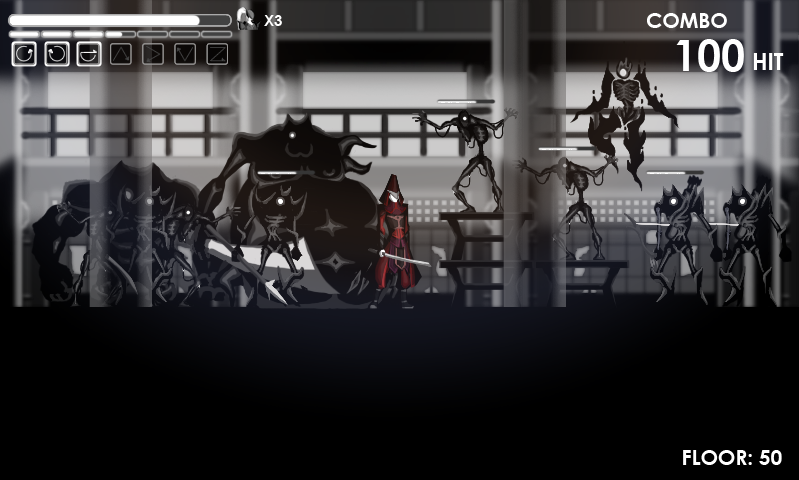

# Mugen

This is the home of Mugen, an action side scroller for the small screen.
Think [Contra](https://en.wikipedia.org/wiki/Contra_(video_game)).

We love twitchy games, and we love touching our phones.
We believe love for the controls must come first.

Sonic Punch Studio.

## Concepts

### Environment

### Character

### Game Play

